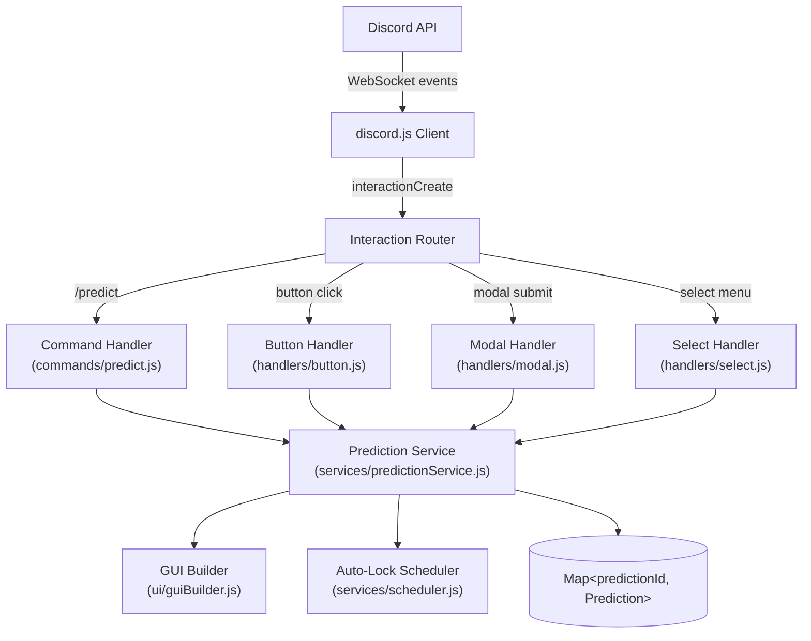

# Design Document: Discord Prediction Bot

## Overview

The Discord Prediction Bot is a Node.js application built with [discord.js v14](https://discord.js.org/) that lets a group of friends run live prediction/betting events inside a Discord server. A user invokes `/predict`, fills in a modal form, and the bot posts an interactive embed with voting buttons. Votes are tracked in real time, the prediction auto-locks after a configurable timeout, and the creator can finalize the result — triggering a loser announcement that tags everyone who guessed wrong.

### Tech Stack

| Layer | Choice | Rationale |
|---|---|---|
| Runtime | Node.js 20 LTS | Stable, well-supported, async-friendly |
| Discord library | discord.js v14 | Most popular, best-documented, full API coverage |
| Testing | Jest + `@fast-check/jest` | Jest is the standard Node test runner; fast-check adds property-based testing |
| Language | JavaScript (ESM) | Beginner-friendly; TypeScript can be added later |


### Key Design Decisions

- **In-memory store**: Active predictions are kept in a `Map` module-level variable inside `predictionService.js` for fast access during interactions. State is not persisted across restarts — this is an intentional trade-off for a casual gaming tool.
- **Custom ID encoding**: Discord button/select `customId` fields encode the prediction ID and action (e.g. `vote:abc123:0`), allowing stateless interaction routing without a session store.
- **Single `interactionCreate` router**: All interactions (slash commands, buttons, modals, select menus) flow through one event handler that dispatches to the appropriate handler module.
- **Scheduled auto-lock via `setTimeout`**: Each active prediction holds a `NodeJS.Timeout` reference in memory alongside the prediction object.

---

## Architecture



---

## Components and Interfaces

### 1. Interaction Router (`src/index.js`)

The entry point. Registers the `interactionCreate` event and dispatches to the correct handler.

```js
client.on('interactionCreate', async (interaction) => {
  if (interaction.isChatInputCommand()) return handleCommand(interaction);
  if (interaction.isButton())           return handleButton(interaction);
  if (interaction.isModalSubmit())      return handleModal(interaction);
  if (interaction.isStringSelectMenu()) return handleSelect(interaction);
});
```

### 2. Command Handler (`src/commands/predict.js`)

Handles the `/predict` slash command. Responds by showing the Setup Form modal.

```js
// Key function signatures
async function execute(interaction)
// Shows ModalBuilder with 7 TextInputBuilder fields:
//   - predictionDescription (required, short)
//   - answer1 (required, short)
//   - answer2 (required, short)
//   - answer3..5 (optional, short)
//   - lockTimeout (required, short, default hint "3")
```

### 3. Modal Handler (`src/handlers/modal.js`)

Handles modal submissions. Validates input, then delegates to `PredictionService`.

```js
async function handlePredictModal(interaction)
// 1. Extract and validate fields via validators.js
// 2. On error: interaction.reply({ content: errorMsg, flags: MessageFlags.Ephemeral })
// 3. On success: predictionService.createPrediction(interaction, validatedData)
```

### 4. Button Handler (`src/handlers/button.js`)

Parses `customId` and routes to the correct action.

```js
// customId format: "<action>:<predictionId>[:<extra>]"
// Actions: "vote", "lock", "cancel", "finalize"
async function handleButton(interaction)
// Parses customId, loads prediction, checks creator auth where needed
```

### 5. Select Handler (`src/handlers/select.js`)

Handles the finalize answer-selection menu and the cancel-reason confirmation.

```js
async function handleSelect(interaction)
// customId format: "finalize_answer:<predictionId>"
```

### 6. Prediction Service (`src/services/predictionService.js`)

The core business logic layer. All state mutations go through here. Predictions are stored in a module-level `Map<predictionId, Prediction>` — no external store or database.

```js
async function createPrediction(interaction, { description, answers, timeoutMinutes })
// Returns: Prediction object; side effects: adds to in-memory map, posts GUI, schedules auto-lock

async function castVote(predictionId, userId, username, answerIndex)
// Returns: { ok: boolean, error?: string }
// Side effects: updates in-memory map, triggers GUI refresh

async function lockPrediction(predictionId, reason)
// reason: 'manual' | 'timeout'
// Side effects: updates in-memory map, cancels scheduler, refreshes GUI

async function cancelPrediction(predictionId, cancellationReason)
// Side effects: updates in-memory map, refreshes GUI

async function finalizePrediction(predictionId, correctAnswerIndex)
// Side effects: updates in-memory map, refreshes GUI, posts loser announcement
```

### 7. GUI Builder (`src/ui/guiBuilder.js`)

Pure functions that build Discord embeds and action rows from a `Prediction` object. No side effects.

```js
function buildPredictionEmbed(prediction)
// Returns: EmbedBuilder

function buildActionRows(prediction)
// Returns: ActionRowBuilder[]
// ACTIVE:    [answer buttons row(s), [Lock | Cancel] row]
// LOCKED:    [[Finalize | Cancel] row]
// FINALIZED: [] (no buttons)
// CANCELLED: [] (no buttons)

function buildLoserMessage(prediction, loserIds)
// Returns: string — the announcement message
```

### 8. Validators (`src/utils/validators.js`)

Pure validation functions. Return `{ valid: true }` or `{ valid: false, error: string }`.

```js
function validateDescription(value)   // 1–200 chars
function validateAnswer(value)        // 1–50 chars (for non-empty slots)
function validateTimeout(value)       // positive integer string
function collectAnswers(slots)        // filters empty slots, returns ordered array
```

### 9. Scheduler (`src/services/scheduler.js`)

Manages `setTimeout` handles for auto-lock.

```js
function schedule(predictionId, delayMs, callback)
// Stores timeout handle in a Map<predictionId, TimeoutHandle>

function cancel(predictionId)
// Calls clearTimeout and removes from map

function getRemainingMs(predictionId)
// Returns approximate remaining ms (used for embed display)
```

---

## Data Models

### Prediction Object (in-memory)

```js
{
  id: string,              // UUID v4
  guildId: string,         // Discord guild (server) ID
  channelId: string,       // Discord channel ID
  messageId: string,       // ID of the posted GUI message
  creatorId: string,       // Discord user ID of the creator
  description: string,     // 1–200 chars
  answers: string[],       // Ordered list of 2–5 answer strings
  status: 'ACTIVE' | 'LOCKED' | 'FINALIZED' | 'CANCELLED',
  correctAnswerIndex: number | null,   // Set on finalization
  cancellationReason: string | null,   // Set on cancellation
  timeoutMinutes: number,  // Creator-specified lock timeout
  createdAt: number,       // Unix timestamp (ms) of creation
  votes: Map<string, number>  // userId → answerIndex
}
```

### Custom ID Encoding

Discord component `customId` values (max 100 chars) encode all routing information:

| Interaction | customId format | Example |
|---|---|---|
| Vote button | `vote:<predictionId>:<answerIndex>` | `vote:abc123:0` |
| Lock button | `lock:<predictionId>` | `lock:abc123` |
| Cancel button | `cancel:<predictionId>` | `cancel:abc123` |
| Finalize button | `finalize:<predictionId>` | `finalize:abc123` |
| Finalize select | `finalize_answer:<predictionId>` | `finalize_answer:abc123` |
| Cancel modal | `cancel_modal:<predictionId>` | `cancel_modal:abc123` |

Prediction IDs are short UUID v4 strings (36 chars), keeping all customIds well under the 100-char limit.

---

## Correctness Properties

*A property is a characteristic or behavior that should hold true across all valid executions of a system — essentially, a formal statement about what the system should do. Properties serve as the bridge between human-readable specifications and machine-verifiable correctness guarantees.*

### Property 1: Description validation accepts exactly the valid length range

*For any* string, `validateDescription` SHALL return valid if and only if the string length is between 1 and 200 characters (inclusive).

**Validates: Requirements 1.2**

---

### Property 2: Answer validation accepts exactly the valid length range

*For any* non-empty answer string, `validateAnswer` SHALL return valid if and only if the string length is between 1 and 50 characters (inclusive).

**Validates: Requirements 1.5**

---

### Property 3: Timeout validation accepts only positive integers

*For any* input value, `validateTimeout` SHALL return valid if and only if the value parses as a positive integer (≥ 1).

**Validates: Requirements 1.6**

---

### Property 4: Answer slot collection preserves order and filters empties

*For any* array of up to 5 slot values (some empty, some non-empty), `collectAnswers` SHALL return an ordered list containing exactly the non-empty slot values in their original relative order.

**Validates: Requirements 1.4**

---

### Property 5: Prediction creation stores all fields correctly

*For any* valid form submission (valid description, 2–5 valid answers, valid timeout), `createPrediction` SHALL produce a Prediction object whose `description`, `answers`, `timeoutMinutes`, `status`, and `creatorId` match the submitted values exactly.

**Validates: Requirements 1.8**

---

### Property 6: Vote casting records the correct answer

*For any* active prediction and any (userId, answerIndex) pair where answerIndex is within bounds, `castVote` SHALL result in the prediction's vote map containing exactly `answerIndex` for `userId`.

**Validates: Requirements 3.1, 3.3**

---

### Property 8: Vote changing replaces the previous vote

*For any* active prediction where a user has an existing vote, calling `castVote` with a different answerIndex SHALL result in only the new answerIndex being stored for that user — the old vote SHALL be gone.

**Validates: Requirements 3.2, 3.3**

---

### Property 9: Locked predictions reject all vote attempts

*For any* prediction in LOCKED status and any (userId, answerIndex) pair, `castVote` SHALL return `{ ok: false }` and the vote map SHALL remain unchanged.

**Validates: Requirements 5.2**

---

### Property 10: Loser identification is correct for all vote distributions

*For any* finalized prediction with a `correctAnswerIndex` and any map of user votes, `identifyLosers` SHALL return exactly the set of userIds whose stored answerIndex differs from `correctAnswerIndex`.

**Validates: Requirements 7.3**

---

### Property 11: Loser announcement mentions every loser

*For any* non-empty list of loser Discord user IDs, `buildLoserMessage` SHALL return a string that contains a Discord mention (`<@userId>`) for every userId in the list.

**Validates: Requirements 7.4**

---

### Property 12: Finalized embed shows correct answer and all votes

*For any* finalized prediction object, `buildPredictionEmbed` SHALL return an embed whose description or fields contain the correct answer string and the vote count for every answer option.

**Validates: Requirements 7.6**

---

### Property 13: Active prediction embed contains all required fields

*For any* active prediction object, `buildPredictionEmbed` SHALL return an embed containing the prediction description, all answer strings, and a vote tally for each answer.

**Validates: Requirements 2.1, 2.2**

---

### Property 14: Action rows contain exactly one button per answer (active state)

*For any* active prediction with N answers (2 ≤ N ≤ 5), `buildActionRows` SHALL produce action rows containing exactly N answer buttons.

**Validates: Requirements 2.4**

---

### Property 15: Cancelled embed shows reason when provided

*For any* cancelled prediction, `buildPredictionEmbed` SHALL include the cancellation reason in the embed if and only if the reason is a non-empty string.

**Validates: Requirements 6.4**

---

## Error Handling

### Validation Errors (form submission)

- All validation errors are returned as ephemeral replies (visible only to the user who triggered the interaction).
- The error message describes which field failed and why (e.g. "Answer 1 must be between 1 and 50 characters").
- No prediction is created on any validation failure.

### Interaction Errors (button/select on stale message)

- If a button interaction references a prediction ID not found in the store (e.g. after a crash and incomplete restore), the bot replies ephemerally: "This prediction is no longer available."
- Discord interactions must be acknowledged within 3 seconds. All handlers call `interaction.deferReply()` or `interaction.deferUpdate()` immediately if any async work is needed.

### Authorization Errors

- Non-creator attempts to lock, cancel, or finalize reply ephemerally: "Only the prediction creator can do that."

### Discord API Errors

- Message edit failures (e.g. message deleted by a moderator) are caught and logged. The prediction state in memory remains valid even if the GUI message is gone.

### Concurrent Interactions

- Discord can deliver multiple button clicks nearly simultaneously. Because Node.js is single-threaded, the in-memory `Map` is mutated synchronously within each event loop tick, so there are no race conditions.

---

## Testing Strategy

### Overview

Testing uses **Jest** as the test runner and **`@fast-check/jest`** for property-based tests. The `fast-check` library generates hundreds of random inputs per property, catching edge cases that hand-written examples miss.

### Unit Tests

Unit tests cover specific examples, edge cases, and authorization checks. They mock the Discord client.

Key unit test areas:
- Validator functions with boundary values (length 0, 1, 50, 51, 200, 201)
- `buildActionRows` for each prediction status (ACTIVE, LOCKED, FINALIZED, CANCELLED)
- `buildLoserMessage` with empty loser list (everyone correct case)
- Creator-only button handlers with non-creator userId
- Auto-lock scheduling and cancellation with fake timers (`jest.useFakeTimers()`)
- State transitions: ACTIVE → LOCKED, LOCKED → FINALIZED, ACTIVE/LOCKED → CANCELLED

### Property-Based Tests

Property tests use `@fast-check/jest`'s `test.prop` helper. Each test runs a minimum of **100 iterations**.

Each test is tagged with a comment referencing its design property:
```js
// Feature: discord-prediction-bot, Property 5: Answer serialization round-trip
test.prop([fc.array(fc.string({ minLength: 1, maxLength: 50 }), { minLength: 2, maxLength: 5 })])(
  'serialize/deserialize round-trip',
  (answers) => {
    expect(deserialize(serialize(answers))).toEqual(answers);
  }
);
```

Properties to implement as property-based tests (referencing design properties above):

| Test | Design Property | Module Under Test |
|---|---|---|
| Description validation length range | Property 1 | `validators.js` |
| Answer validation length range | Property 2 | `validators.js` |
| Timeout validation positive integer | Property 3 | `validators.js` |
| Answer slot collection order/filter | Property 4 | `validators.js` |
| Answer serialization round-trip | Property 5 | `answerSerializer.js` |
| Prediction creation field mapping | Property 6 | `predictionService.js` (mocked DB) |
| Vote casting records correct answer | Property 7 | `predictionService.js` (in-memory) |
| Vote changing replaces previous | Property 8 | `predictionService.js` (in-memory) |
| Locked prediction rejects votes | Property 9 | `predictionService.js` (in-memory) |
| Loser identification correctness | Property 10 | `predictionService.js` |
| Loser announcement mentions all | Property 11 | `guiBuilder.js` |
| Finalized embed completeness | Property 12 | `guiBuilder.js` |
| Active embed completeness | Property 13 | `guiBuilder.js` |
| Action rows answer button count | Property 14 | `guiBuilder.js` |
| Cancelled embed shows reason | Property 15 | `guiBuilder.js` |

### Test File Structure

```
src/
  __tests__/
    unit/
      validators.test.js
      answerSerializer.test.js
      guiBuilder.test.js
      predictionService.test.js
      scheduler.test.js
```

### Running Tests

```bash
# Run all tests once (no watch mode)
npx jest --runInBand

# Run with coverage
npx jest --coverage
```
