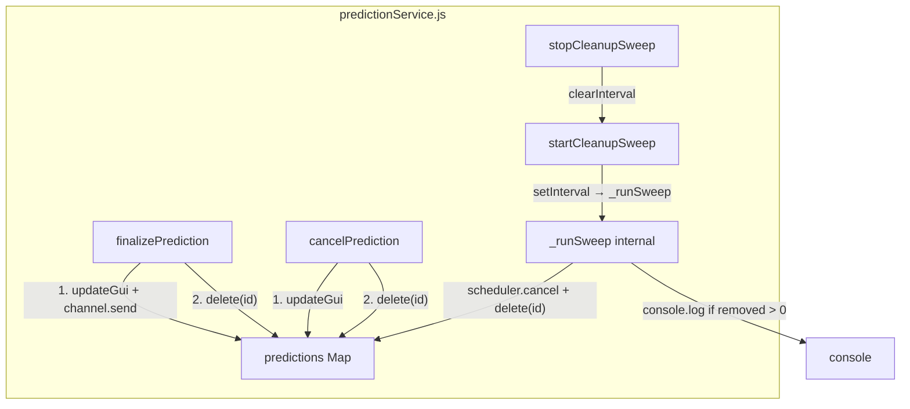

# Design Document: Prediction Memory Cleanup

## Overview

The Discord prediction bot holds all predictions in a module-level `Map<string, Prediction>` inside
`predictionService.js`. Because the process runs continuously, predictions that have reached a
terminal state (FINALIZED or CANCELLED) and predictions that were created long ago but never
resolved accumulate indefinitely.

This design adds two complementary cleanup mechanisms to `predictionService.js`:

1. **Terminal-state eviction** — delete a prediction from the Map immediately after
   `finalizePrediction` or `cancelPrediction` completes all side-effects.
2. **Age-based expiry sweep** — a configurable repeating timer that scans the Map and removes any
   prediction whose `createdAt` is older than a configurable threshold (default 24 h), cancelling
   its scheduler timer if one is still running.

Both mechanisms are additive changes to the existing module; no public API signatures are changed
and no new modules are introduced.

---

## Architecture

The feature is entirely contained within `src/services/predictionService.js`. No new files are
needed.



The sweep timer handle is stored in a module-level variable `_sweepHandle` (initially `null`).
`startCleanupSweep` assigns it; `stopCleanupSweep` clears it.

---

## Components and Interfaces

### Modified: `finalizePrediction(predictionId, correctAnswerIndex)`

After the existing `await channel.send(...)` call, add:

```js
predictions.delete(predictionId);
```

No signature change. The deletion is the last statement in the function.

### Modified: `cancelPrediction(predictionId, cancellationReason)`

After the existing `await updateGui(prediction)` call, add:

```js
predictions.delete(predictionId);
```

No signature change.

### New: `startCleanupSweep(intervalMs = 3_600_000, ageThresholdMs = 86_400_000)`

```js
export function startCleanupSweep(
  intervalMs = 3_600_000,
  ageThresholdMs = 86_400_000
) {
  stopCleanupSweep();                          // idempotent restart
  _sweepHandle = setInterval(
    () => _runSweep(ageThresholdMs),
    intervalMs
  );
}
```

### New: `stopCleanupSweep()`

```js
export function stopCleanupSweep() {
  if (_sweepHandle !== null) {
    clearInterval(_sweepHandle);
    _sweepHandle = null;
  }
}
```

### New (internal): `_runSweep(ageThresholdMs)`

```js
function _runSweep(ageThresholdMs) {
  const now = Date.now();
  const removed = [];

  for (const [id, prediction] of predictions) {
    if (now - prediction.createdAt > ageThresholdMs) {
      scheduler.cancel(id);
      predictions.delete(id);
      removed.push(id);
    }
  }

  if (removed.length > 0) {
    console.log(
      `[cleanup] Removed ${removed.length} stale prediction(s) at ${new Date(now).toISOString()}`
    );
  }
}
```

Iterating over a `Map` while deleting entries is safe in JavaScript: the spec guarantees that
entries added after iteration begins are not visited, and deleted entries are skipped if not yet
visited. This means a prediction deleted by a concurrent terminal-state eviction before the sweep
reaches it will simply be absent from the Map — `predictions.delete(id)` on a missing key is a
no-op.

---

## Data Models

No new data structures are introduced. The existing `Prediction` typedef is unchanged.

One new module-level variable is added to `predictionService.js`:

```js
/** @type {ReturnType<typeof setInterval> | null} */
let _sweepHandle = null;
```

---

## Correctness Properties

*A property is a characteristic or behavior that should hold true across all valid executions of a
system — essentially, a formal statement about what the system should do. Properties serve as the
bridge between human-readable specifications and machine-verifiable correctness guarantees.*

### Property 1: Terminal-state eviction removes prediction from Map

*For any* prediction present in the `predictions` Map, after `finalizePrediction` or
`cancelPrediction` completes (without throwing), the Map SHALL NOT contain an entry for that
prediction's ID.

**Validates: Requirements 1.1, 1.2**

### Property 2: Side-effects complete before eviction

*For any* prediction, when `finalizePrediction` is called, `channel.send` (loser announcement)
SHALL have been called before the prediction is absent from the Map; when `cancelPrediction` is
called, `message.edit` (updateGui) SHALL have been called before the prediction is absent from the
Map.

**Validates: Requirements 1.3, 1.4**

### Property 3: Missing-ID operations are no-ops

*For any* string ID that is not present in the `predictions` Map, calling `finalizePrediction` or
`cancelPrediction` with that ID SHALL return without throwing and SHALL leave the Map unchanged.

**Validates: Requirements 1.5, 4.2**

### Property 4: Sweep removes exactly the stale predictions

*For any* set of predictions with arbitrary `createdAt` values and any `ageThresholdMs`, after
`_runSweep` executes: every prediction whose age exceeded the threshold SHALL be absent from the
Map, and every prediction whose age did not exceed the threshold SHALL remain in the Map — including
predictions that were already absent before the sweep began (graceful missing-key handling).

**Validates: Requirements 2.3, 2.5, 4.1**

### Property 5: Scheduler timer cancelled for every evicted stale prediction

*For any* stale prediction that had an active scheduler timer at the time the sweep runs,
`scheduler.cancel` SHALL be called with that prediction's ID before the entry is removed from the
Map.

**Validates: Requirements 2.4**

### Property 6: Log emitted if and only if sweep removes entries

*For any* invocation of `_runSweep`: if one or more predictions were removed, `console.log` SHALL
be called exactly once with a message containing the removed count and a timestamp; if zero
predictions were removed, `console.log` SHALL NOT be called.

**Validates: Requirements 3.1, 3.2**

### Property 7: Map invariant after mixed operations

*For any* sequence of `finalizePrediction`, `cancelPrediction`, and `_runSweep` calls applied to
any initial set of predictions, the `predictions` Map SHALL contain only predictions whose status
is neither FINALIZED nor CANCELLED AND whose age does not exceed the configured threshold.

**Validates: Requirements 4.3**

---

## Error Handling

| Scenario | Behaviour |
|---|---|
| `finalizePrediction` / `cancelPrediction` called with unknown ID | Early `return` (already present); `predictions.delete` on missing key is a no-op |
| `stopCleanupSweep` called before `startCleanupSweep` | `_sweepHandle` is `null`; the `if` guard prevents `clearInterval(null)` |
| `startCleanupSweep` called twice | First call to `stopCleanupSweep()` inside clears the previous interval before setting a new one |
| Sweep encounters a key already deleted by eviction | `Map.delete` on a missing key returns `false` silently; `scheduler.cancel` on a missing ID is already a no-op (existing behaviour) |
| `updateGui` or `channel.send` throws inside `finalizePrediction` / `cancelPrediction` | The existing `try/catch` in `updateGui` absorbs Discord API errors; if `channel.send` throws, the `predictions.delete` at the end of `finalizePrediction` will not execute — this is acceptable because the prediction remains in the Map and can be retried or swept later |

---

## Testing Strategy

The project uses **Jest** with **`@fast-check/jest`** for property-based testing. All new tests go
in `src/__tests__/unit/predictionService.test.js`, following the existing pattern of
`jest.unstable_mockModule` for `guiBuilder` and `scheduler`.

### Unit / Example Tests

- `startCleanupSweep` with no arguments uses the correct defaults (advance fake timer by
  3 600 000 ms, verify sweep fires).
- `stopCleanupSweep` after `startCleanupSweep` prevents further sweep executions.
- `stopCleanupSweep` before `startCleanupSweep` does not throw.
- `finalizePrediction` / `cancelPrediction` do not emit extra `console.log` calls for the eviction
  step (Requirement 3.3).

### Property-Based Tests

Each property test uses `test.prop` from `@fast-check/jest` and runs a minimum of **100
iterations**. Each test is tagged with a comment referencing the design property.

| Test | Arbitraries | Assertion |
|---|---|---|
| P1 — Terminal eviction | random prediction fields | `predictions.has(id) === false` after finalize/cancel |
| P2 — Side-effects before eviction | random vote distributions | mock call order verified |
| P3 — Missing-ID no-op | random string IDs | no throw, Map size unchanged |
| P4 — Sweep removes exactly stale | random `createdAt` offsets, random threshold | post-sweep Map contains only fresh entries |
| P5 — Scheduler cancel for stale | random stale predictions with timers | `scheduler.cancel` called for each |
| P6 — Log iff removed | random mix of stale/fresh | `console.log` call count matches expectation |
| P7 — Map invariant | random operation sequences | Map contains only valid live predictions |

Tag format used in test comments:
`// Feature: prediction-memory-cleanup, Property N: <property_text>`
